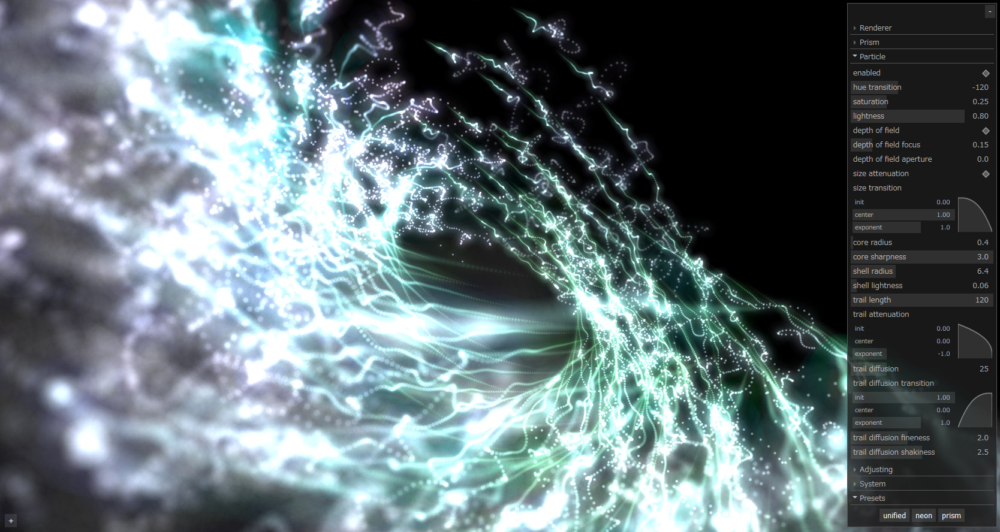
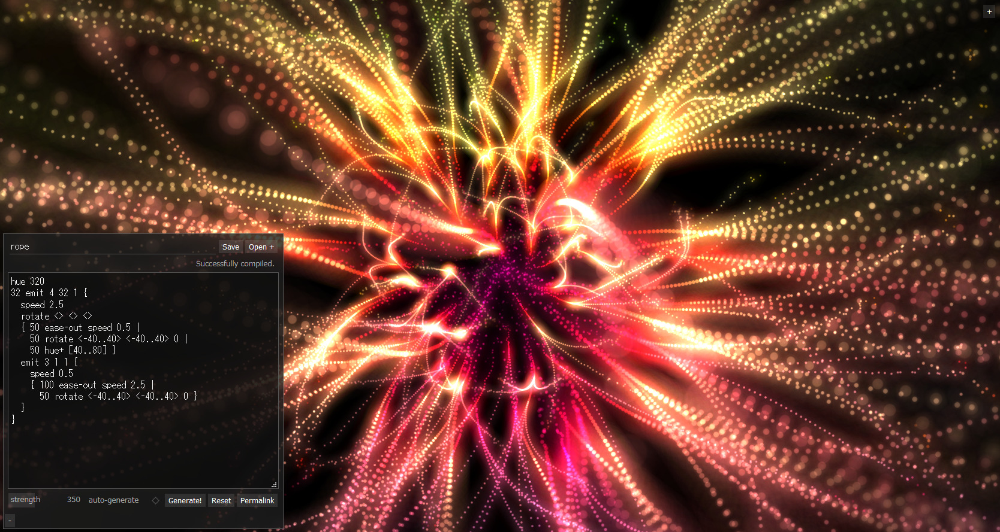

# emitter3d


Geometric fireworks simulator

- [Live Demo](https://yubrot.github.io/emitter3d/)
- [How this works (Japanese)](https://scrapbox.io/yubrot/emitter3d)

## Screenshots






## Build

```
$ npm ci
$ npm run build
```
