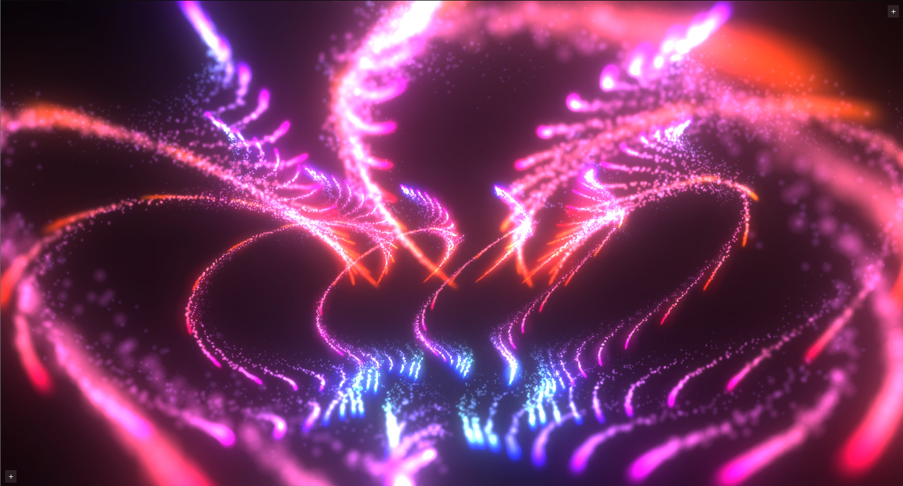
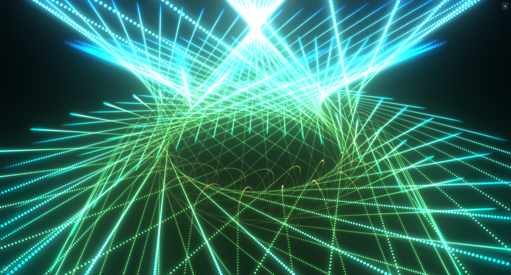
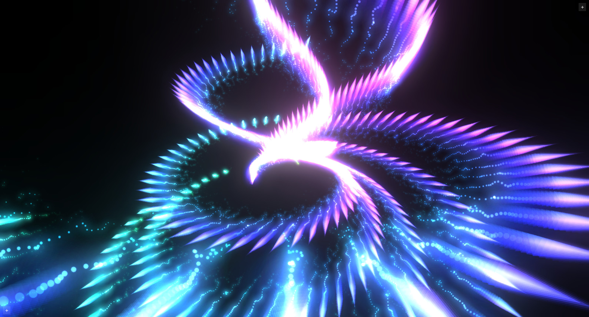
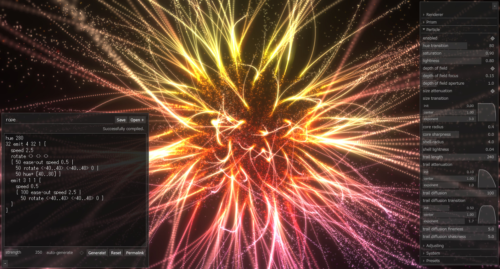

# emitter3d


Geometric fireworks simulator, built with three.js.

- [Live Demo](https://yubrot.github.io/emitter3d/)
- [How Simulator works? (Japanese)](https://scrapbox.io/yubrot/emitter3d:_How_Simulator_works%3F)
- [How Viewer works? (Japanese)](https://scrapbox.io/yubrot/emitter3d:_How_Viewer_works%3F)

## Screenshots

[](https://yubrot.github.io/emitter3d/#eyJzdGVwc1BlclVwZGF0ZSI6MC40LCJlZGl0aW5nSXRlbSI6IkdlbmVyYXRpb24gMTgiLCJlZGl0aW5nQ29kZSI6Imh1ZSAyMDFcbmVtaXQgMSAxIDkge1xuICByb3RhdGUgMCBbXSAwXG4gIGh1ZSsgNjBcbiAgc3BlZWQgMS43XG4gIHtcbiAgICA4NSBlYXNlLW91dCBzcGVlZCAwLjJcbiAgfFxuICAgIDg1IGVhc2UtaW4gcm90YXRlIDY1IDAgMTI0XG4gIH1cbiAge1xuICAgIDY3IGVtaXQgMSAxMyAxIHtcbiAgICAgIGh1ZSsgNjBcbiAgICAgIHNwZWVkIDEuMDJcbiAgICAgIDM5IG5vcFxuICAgICAgMCBlbWl0IDIgMSAxIHtcbiAgICAgICAgcm90YXRlIDAgMCBbXVxuICAgICAgICByb3RhdGUgMTIwIDAgMFxuICAgICAgICBodWUrIDYwXG4gICAgICAgIHNwZWVkIDIuMTJcbiAgICAgICAge1xuICAgICAgICAgIDYxIGVhc2UtaW4gc3BlZWQqIDAuMjFcbiAgICAgICAgfFxuICAgICAgICAgIDYxIGVhc2UtaW4gcm90YXRlIDIwMiAwIC0xODBcbiAgICAgICAgfFxuICAgICAgICAgIDMwLjUgbm9wXG4gICAgICAgICAgMzAuNSBodWUrIC0xMjJcbiAgICAgICAgfVxuICAgICAgICAxODAgbm9wXG4gICAgICAgIDMwIG9wYWNpdHkgMFxuICAgICAgICBjbG9zZVxuICAgICAgfVxuICAgIH1cbiAgfFxuICAgIDY3IGVhc2UtaW4gcm90YXRlIDAgMTc3IDBcbiAgfVxufSIsImdlbmVyYXRlQXV0b21hdGljYWxseSI6ZmFsc2UsImJsb29tU3RyZW5ndGgiOjEsInBhcnRpY2xlRG9mIjp0cnVlLCJwYXJ0aWNsZUNvcmVSYWRpdXMiOjAuNiwicGFydGljbGVTaGVsbFJhZGl1cyI6OC4wMDAwMDAwMDAwMDAwMDUsInBhcnRpY2xlU2hlbGxMaWdodG5lc3MiOjAuMDMsInBhcnRpY2xlVHJhaWxEaWZmdXNpb25TY2FsZSI6MzAsInBhcnRpY2xlVHJhaWxEaWZmdXNpb25UcmFuc2l0aW9uIjp7ImluaXQiOjAsImNlbnRlciI6MCwiZXhwb25lbnQiOi0yfSwicGFydGljbGVUcmFpbERpZmZ1c2lvbkZpbmVuZXNzIjo1LCJwYXJ0aWNsZVRyYWlsRGlmZnVzaW9uU2hha2luZXNzIjozLjUwMDAwMDAwMDAwMDAwMDR9)
[](https://yubrot.github.io/emitter3d/#eyJzdGVwc1BlclNlY29uZCI6MTcwLCJlZGl0aW5nSXRlbSI6IkdlbmVyYXRpb24gODYiLCJlZGl0aW5nQ29kZSI6Imh1ZSAyODNcbjAgZW1pdCAxMSAxIDMge1xuICByb3RhdGUgMCBbXSAwXG4gIGh1ZSsgNjBcbiAgc3BlZWQgMi4wMlxuICA4MiBlYXNlLW91dCBzcGVlZCAwLjJcbiAge1xuICAgIDY3IGVtaXQgMSA3IDEge1xuICAgICAgaHVlKyA2MFxuICAgICAgc3BlZWQgMC4zXG4gICAgICAyOSBub3BcbiAgICAgIHtcbiAgICAgICAgNDggZWFzZS1pbiBzcGVlZCogNC4zMlxuICAgICAgfFxuICAgICAgICA0OCBlYXNlLWluIHJvdGF0ZSAyOSAxMjcgMVxuICAgICAgfFxuICAgICAgICA0OCBodWUrIDE0NFxuICAgICAgfVxuICAgICAgMTAzIGNsb3NlXG4gICAgICAxMjAgbm9wXG4gICAgICAzMCBvcGFjaXR5IDBcbiAgICB9XG4gIHxcbiAgICA2NyBlYXNlLWluIHJvdGF0ZSAxMzMgMTYzIDE1N1xuICB9XG59IiwiZ2VuZXJhdGVBdXRvbWF0aWNhbGx5IjpmYWxzZSwicHJpc21TYXR1cmF0aW9uIjowLjQsInByaXNtTGlnaHRuZXNzIjowLjQsInByaXNtVHJhaWxMZW5ndGgiOjI0LCJwcmlzbVRyYWlsU3RlcCI6MSwicHJpc21UcmFpbEF0dGVudWF0aW9uIjp7ImluaXQiOjAuMiwiY2VudGVyIjoxLCJleHBvbmVudCI6LTJ9LCJwYXJ0aWNsZVRyYWlsTGVuZ3RoIjoyNDAsInBhcnRpY2xlVHJhaWxEaWZmdXNpb25TY2FsZSI6MH0%3D)
[](https://yubrot.github.io/emitter3d/#eyJzdGVwc1BlclNlY29uZCI6MTIwLCJzdGVwc1BlclVwZGF0ZSI6MC44MDAwMDAwMDAwMDAwMDAyLCJlZGl0aW5nSXRlbSI6IkdlbmVyYXRpb24gMTMyIiwiZWRpdGluZ0NvZGUiOiJodWUgMTQwXG4yMDcgZW1pdCAxIDYwIDEge1xuICByb3RhdGUgMCBbMC4uMzYwXSAwXG4gIGh1ZSsgWzAuLjEyMF1cbiAge1xuICAgIHNwZWVkIDIuNzVcbiAgICAxMiBub3BcbiAgICBzcGVlZCAwXG4gIHxcbiAgICA1MyBlYXNlLW91dCByb3RhdGUgODYgMTAxIDBcbiAgfVxuICAwIGVtaXQgMiAxIDQge1xuICAgIHJvdGF0ZSAwIDAgW11cbiAgICByb3RhdGUgMTIwIDAgMFxuICAgIGh1ZSsgNjBcbiAgICBzcGVlZCAwLjgyXG4gICAgNzAgZWFzZS1pbiByb3RhdGUgMSAwIDEzXG4gICAgNTAgY2xvc2VcbiAgICAxMjAgbm9wXG4gICAgMzAgb3BhY2l0eSAwXG4gIH1cbn0iLCJnZW5lcmF0ZUF1dG9tYXRpY2FsbHkiOmZhbHNlLCJhbnRpYWxpYXMiOnRydWUsImJsb29tVGhyZXNob2xkIjowLjUsInByaXNtIjp0cnVlLCJwcmlzbVNhdHVyYXRpb24iOjAuNiwicHJpc21MaWdodG5lc3MiOjAuNCwicHJpc21TbmFwc2hvdE9mZnNldCI6MTYsInByaXNtVHJhaWxMZW5ndGgiOjI0LCJwcmlzbVRyYWlsU3RlcCI6MSwicHJpc21UcmFpbEF0dGVudWF0aW9uIjp7ImluaXQiOjAuMiwiY2VudGVyIjoxLCJleHBvbmVudCI6LTJ9LCJwYXJ0aWNsZUh1ZVRyYW5zaXRpb24iOi02MCwicGFydGljbGVTYXR1cmF0aW9uIjowLjgsInBhcnRpY2xlTGlnaHRuZXNzIjowLjYsInBhcnRpY2xlU2l6ZVRyYW5zaXRpb24iOnsiaW5pdCI6MCwiY2VudGVyIjoxLCJleHBvbmVudCI6LTF9LCJwYXJ0aWNsZUNvcmVSYWRpdXMiOjEuMiwicGFydGljbGVDb3JlU2hhcnBuZXNzIjozLCJwYXJ0aWNsZVNoZWxsUmFkaXVzIjoyMCwicGFydGljbGVTaGVsbExpZ2h0bmVzcyI6MC4wOCwicGFydGljbGVTbmFwc2hvdE9mZnNldCI6MjYsInBhcnRpY2xlVHJhaWxMZW5ndGgiOjU1LCJwYXJ0aWNsZVRyYWlsQXR0ZW51YXRpb24iOnsiaW5pdCI6MC4zLCJjZW50ZXIiOjEsImV4cG9uZW50IjowLjV9LCJwYXJ0aWNsZVRyYWlsRGlmZnVzaW9uU2NhbGUiOjMwLCJwYXJ0aWNsZVRyYWlsRGlmZnVzaW9uVHJhbnNpdGlvbiI6eyJpbml0IjowLCJjZW50ZXIiOjAsImV4cG9uZW50IjotMn0sInBhcnRpY2xlVHJhaWxEaWZmdXNpb25GaW5lbmVzcyI6My41LCJwYXJ0aWNsZVRyYWlsRGlmZnVzaW9uU2hha2luZXNzIjoyfQ%3D%3D)
[](https://yubrot.github.io/emitter3d/#eyJzdGVwc1BlclVwZGF0ZSI6MC41OTk5OTk5OTk5OTk5OTk4LCJlZGl0aW5nSXRlbSI6InJvcGUiLCJlZGl0aW5nQ29kZSI6Imh1ZSAyODBcbjMyIGVtaXQgNCAzMiAxIHtcbiAgc3BlZWQgMi41XG4gIHJvdGF0ZSA8PiA8PiA8PlxuICB7IDUwIGVhc2Utb3V0IHNwZWVkIDAuNSB8XG4gICAgNTAgcm90YXRlIDwtNDAuLjQwPiA8LTQwLi40MD4gMCB8XG4gICAgNTAgaHVlKyBbNDAuLjgwXSB9XG4gIGVtaXQgMyAxIDEge1xuICAgIHNwZWVkIDAuNVxuICAgIHsgMTAwIGVhc2Utb3V0IHNwZWVkIDIuNSB8XG4gICAgICA1MCByb3RhdGUgPC00MC4uNDA%2BIDwtNDAuLjQwPiAwIH1cbiAgfVxufSIsImdlbmVyYXRlQXV0b21hdGljYWxseSI6ZmFsc2UsImJsb29tU3RyZW5ndGgiOjAuMzk5OTk5OTk5OTk5OTk5ODYsInBhcnRpY2xlSHVlVHJhbnNpdGlvbiI6ODAsInBhcnRpY2xlU2F0dXJhdGlvbiI6MC45LCJwYXJ0aWNsZUxpZ2h0bmVzcyI6MC44LCJwYXJ0aWNsZURvZiI6dHJ1ZSwicGFydGljbGVEb2ZBcGVydHVyZSI6MC45OTk5OTk5OTk5OTk5OTk5LCJwYXJ0aWNsZVNpemVUcmFuc2l0aW9uIjp7ImluaXQiOjAsImNlbnRlciI6MSwiZXhwb25lbnQiOjN9LCJwYXJ0aWNsZUNvcmVSYWRpdXMiOjAuNCwicGFydGljbGVDb3JlU2hhcnBuZXNzIjowLCJwYXJ0aWNsZVNoZWxsUmFkaXVzIjo0LCJwYXJ0aWNsZVNoZWxsTGlnaHRuZXNzIjowLjA0LCJwYXJ0aWNsZVRyYWlsTGVuZ3RoIjoyNDAsInBhcnRpY2xlVHJhaWxBdHRlbnVhdGlvbiI6eyJpbml0IjowLjEsImNlbnRlciI6MSwiZXhwb25lbnQiOjF9LCJwYXJ0aWNsZVRyYWlsRGlmZnVzaW9uVHJhbnNpdGlvbiI6eyJpbml0IjowLjUsImNlbnRlciI6MSwiZXhwb25lbnQiOjEuNzAwMDAwMDAwMDAwMDAwMn0sInBhcnRpY2xlVHJhaWxEaWZmdXNpb25GaW5lbmVzcyI6NSwicGFydGljbGVUcmFpbERpZmZ1c2lvblNoYWtpbmVzcyI6NX0%3D)

## Build

```
$ npm ci
$ npm run build
```
